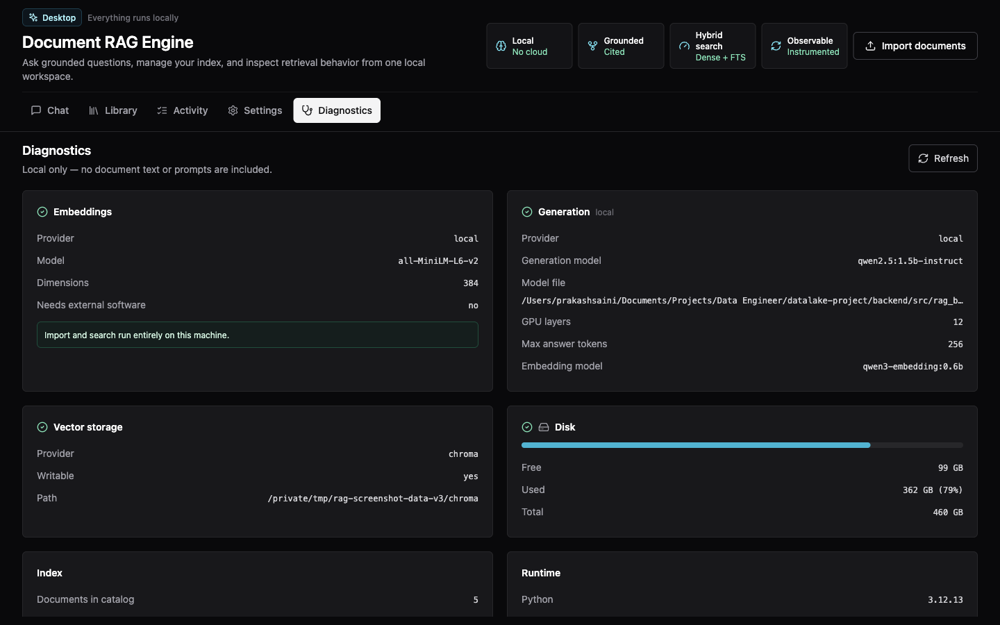
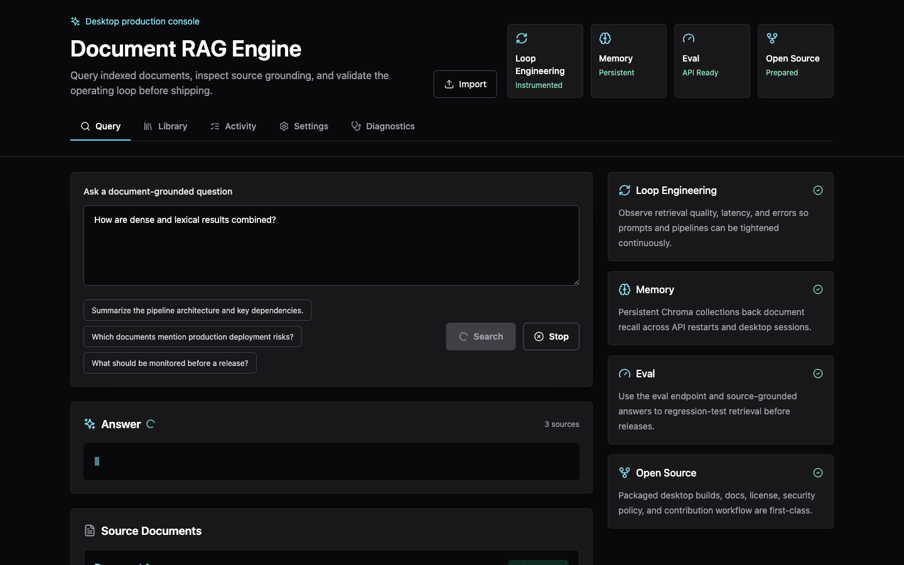
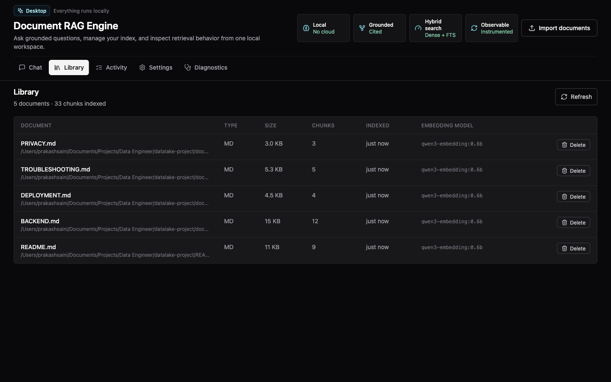
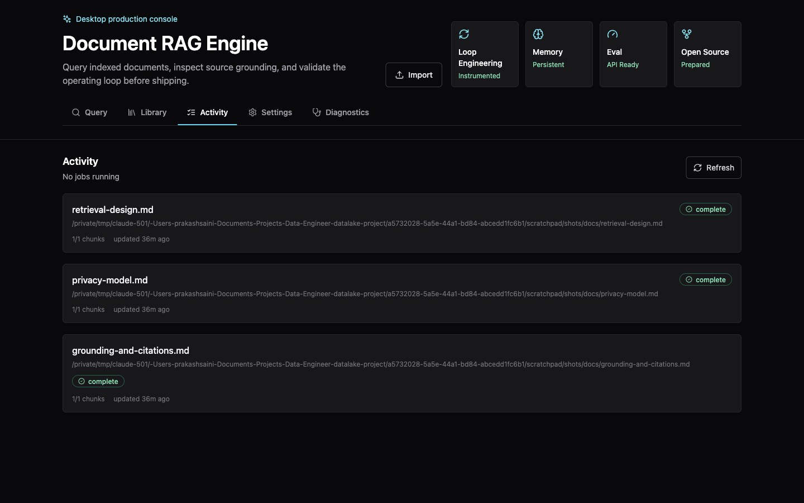
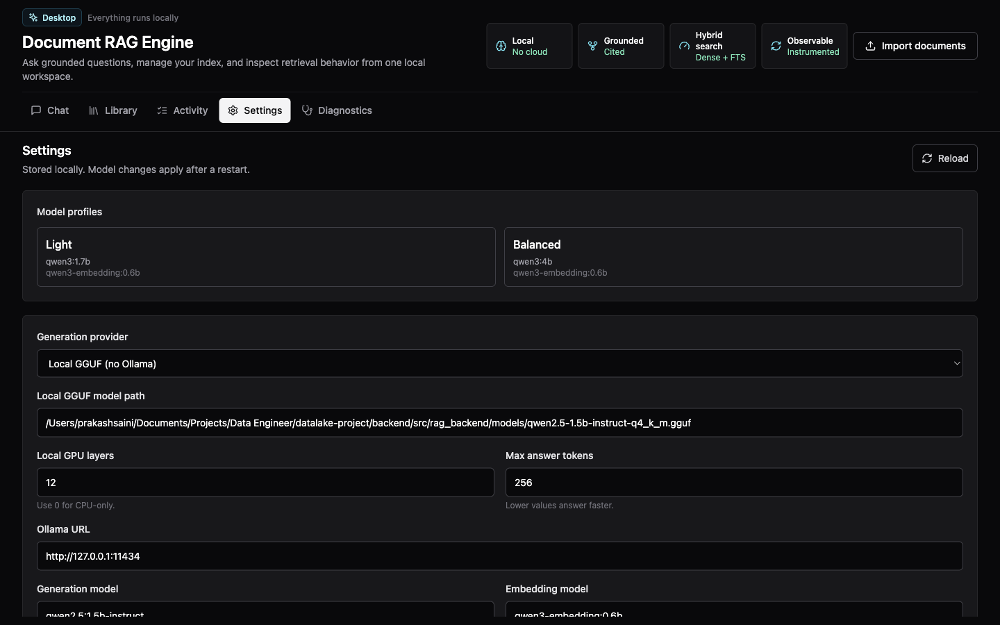

# Document RAG Engine

A local-first desktop application for asking questions of your own documents.
Import PDFs, Word files, Markdown, or HTML; they are parsed, chunked, embedded,
and indexed **on your machine**, and answers cite the passages they came from.

Nothing is sent anywhere. There is no API key, no account, and no cloud service.
Importing and searching need no external software at all — the embedding model
runs inside the app.



> Diagnostics reports the embedding provider running in-process, its vector
> width, and that no external software is required. Ollama is listed separately
> and marked *generation only*.

---

## Contents

- [What it does](#what-it-does)
- [Screenshots](#screenshots)
- [Engineering highlights](#engineering-highlights)
- [Architecture](#architecture)
- [Running it](#running-it)
- [Testing and CI](#testing-and-ci)
- [Repository layout](#repository-layout)
- [Status](#status)

---

## What it does

| | |
| --- | --- |
| **Import** | PDF, DOCX, Markdown, HTML, and text, via a native file picker or drag and drop |
| **Index** | Parsed, chunked, embedded, and stored in a local Chroma collection plus a SQLite catalog |
| **Search** | Dense vector search fused with SQLite FTS5 lexical search |
| **Answer** | Streamed, grounded responses that cite the chunks they used |
| **Operate** | A job queue with progress, retry, and cancel; diagnostics; export, import, and backup |

Generated prose answers are the only feature that needs a local
[Ollama](https://ollama.com) daemon. Without it, the app still imports, searches,
and returns ranked cited passages.

---

## Screenshots

### Query with sources

Retrieved passages are shown with relevance scores and the metadata that
produced them, so an answer can always be traced back to its evidence.



### Library

Every indexed document with its type, size, chunk count, and the embedding model
that produced its vectors — the field that decides whether a reindex is needed.



### Activity

Ingestion runs as a background queue. Each job reports its stage, chunk
progress, and attempt count, and can be cancelled or retried.



### Settings

Model selection, retrieval parameters, and one-click pulls for anything missing.



---

## Engineering highlights

The parts of this project that were interesting to build.

### Embeddings run in-process

The obvious design delegates embeddings to Ollama, which makes it a hard
prerequisite. Instead the sidecar runs **all-MiniLM-L6-v2 through ONNX Runtime**,
so a machine with nothing installed can still import and search. Ollama becomes
an optional upgrade rather than a gate.

The model ships inside the bundle rather than downloading on first run, because
"works offline" is not true if the first launch needs a network. Output was
verified identical to Chroma's reference implementation (cosine 1.0) before the
switch.

### Hybrid retrieval

Dense vector search alone misses exact identifiers and rare terms; lexical
search alone misses paraphrase. Both run, and their rankings are merged with
**reciprocal rank fusion**, which needs no score calibration between retrievers —
cosine similarity and BM25 are not on a comparable scale.

### Citations are validated, not trusted

The model emits `[S1]`-style markers. After generation, every marker is checked
against the chunks that were actually placed in the prompt. A citation pointing
outside that set is reported as invalid rather than rendered, so the interface
never shows a reference that resolves to nothing.

Retrieved text is treated as untrusted: the prompt fences excerpts between
explicit delimiters and states that instructions inside them are data. The eval
corpus includes prompt-injection fixtures that attempt to override the system
prompt and exfiltrate data.

### The index knows what built it

Every write stamps the index with its embedding provider, model, digest, vector
width, chunker and parser versions. Changing any of them means existing vectors
cannot be compared against new queries, so the app refuses the import and offers
a rebuild instead of returning meaningless similarity scores.

This matters because a Chroma collection fixes its vector width on first write,
and that constraint outlives its rows — an emptied index still rejects vectors of
a different size. That case is detected and recovered automatically.

### Models are discovered, not assumed

A hardcoded model tag fails with a 404 on any machine that pulled something
else. The configured name is a *preference*: if it is installed it wins,
otherwise an installed generation model is selected, embedding-only models are
excluded, and the substitution is reported in diagnostics.

### Desktop security

The renderer is sandboxed with context isolation and no Node integration. The UI
is served over a custom `app://` protocol rather than `file://`, under a
restrictive CSP whose inline-script hashes are **generated at build time** so the
policy never needs `unsafe-inline`. Electron fuses disable `RunAsNode`,
`NODE_OPTIONS`, and inspector arguments in packaged builds.

The preload exposes exactly five functions. The renderer never holds the backend
token, never sees a channel name, and has no general-purpose HTTP or IPC bridge.

### Failures are structured

Errors carry machine-readable codes — `model_unavailable`,
`index_model_mismatch`, `no_relevant_evidence`, `generation_timeout` — each
mapped to an HTTP status and a flag for whether the user can act on it. The UI
shows the backend's own message alongside guidance rather than replacing it.

Production logs are redacted: filesystem paths, bearer tokens, and long hex
secrets are stripped from messages *and* from rendered tracebacks, since a
filename alone can disclose the contents of a private library.

---

## Architecture

```
┌──────────────────────────── Electron main ────────────────────────────┐
│  serves the UI over app://   ·   owns the sidecar and its token       │
│  typed IPC   ·   native dialogs   ·   CSP, navigation, permissions    │
└───────────────┬───────────────────────────────────┬───────────────────┘
                │ typed IPC (no HTTP in renderer)   │ spawn + health
                ▼                                   ▼
┌──────────────────────────┐        ┌──────────────────────────────────┐
│  Renderer (Next.js)      │        │  Python sidecar (FastAPI)        │
│  sandboxed, no Node      │        │                                  │
│  Query · Library         │        │  ONNX embeddings (in-process)    │
│  Activity · Settings     │        │  Chroma vectors + SQLite FTS5    │
│  Diagnostics             │        │  ingestion job queue             │
└──────────────────────────┘        │  retrieval · RRF · citations     │
                                    └───────────────┬──────────────────┘
                                                    │ optional, generation only
                                                    ▼
                                            ┌───────────────┐
                                            │    Ollama     │
                                            └───────────────┘
```

The backend follows a clean layering — `api → application → domain`, with
`infrastructure` supplying adapters. Dependencies point inward only.

Full detail: [docs/architecture/BACKEND.md](docs/architecture/BACKEND.md).

---

## Running it

**Prerequisites:** [uv](https://docs.astral.sh/uv/) and Node.js 22.12+.
Ollama is optional.

```bash
make setup        # backend venv, embedding model, frontend dependencies
make desktop      # run the Electron app
```

`make help` lists every target.

For generated answers, install Ollama and pull a small model. Larger models are
slow on CPU-only machines:

```bash
ollama serve
ollama pull qwen3:1.7b
```

The app selects whichever generation model you have installed.

### Without the desktop shell

```bash
make backend-run    # FastAPI on 127.0.0.1:8000
make frontend-run   # Next.js on :3000
```

### Container stack

```bash
cp compose/.env.example compose/.env
make up             # base stack with dev overrides
make up-airflow     # ...plus the Airflow ingestion pipeline
```

---

## Testing and CI

```
254  backend tests      pytest, including the retrieval, citation,
                        job-state-machine, and index-migration paths
 48  frontend tests     Vitest + React Testing Library
  5  end-to-end tests   Playwright driving the real Electron shell
```

`make check` runs lint, format, type checks, and tests. CI additionally
validates every merged Compose configuration and runs the Electron suite
headless. Separate workflows cover CodeQL, dependency audit, and SBOM
generation.

The Electron suite asserts the security boundary directly: that the UI loads
over `app://` rather than `file://`, that the preload surface is exactly the
intended functions, and that `require`, `process`, `ipcRenderer`, and `electron`
are all absent from the renderer.

---

## Repository layout

```
backend/          FastAPI sidecar
  src/rag_backend/
    api/routes/     one module per endpoint group (26 endpoints)
    application/    use cases: retrieval, citations, jobs, evals, data transfer
    domain/         entities, job state machine, index fingerprints
    infrastructure/ ONNX embeddings, Chroma, Ollama, SQLite catalog
  tests/{unit,integration}/
frontend/         Next.js UI + Electron shell
  app/components/   Query, Library, Activity, Settings, Diagnostics
  electron/         main and preload processes
  e2e/              Playwright Electron tests
evals/            fixture corpus and eval cases
compose/          base stack plus dev, prod, and Airflow overlays
infra/airflow/    ingestion DAGs
docs/             architecture, operations, security, ADRs
```

---

## Status

Working and tested: import, indexing, hybrid retrieval, streamed cited answers,
the job queue, diagnostics, export and import, and the packaged Electron shell.

Not yet done: code signing and notarization, and the clean-machine install and
upgrade testing that depends on it. Distribution therefore means building from
source for now.

Documentation index: [docs/INDEX.md](docs/INDEX.md) ·
Licence: [MIT](LICENSE) · Security policy: [SECURITY.md](SECURITY.md)
